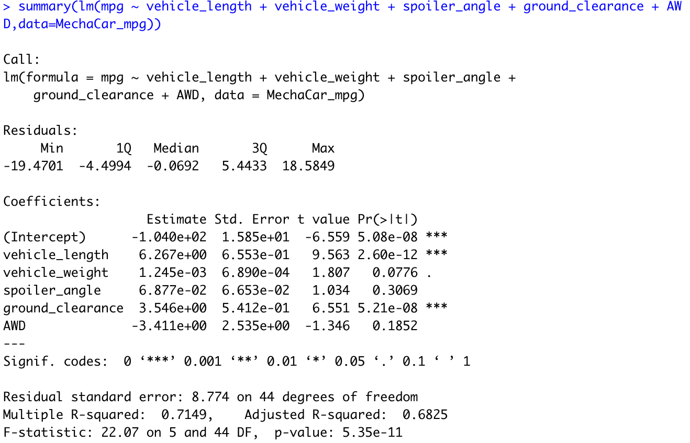
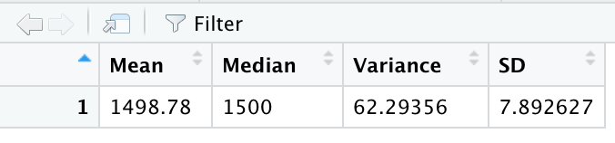
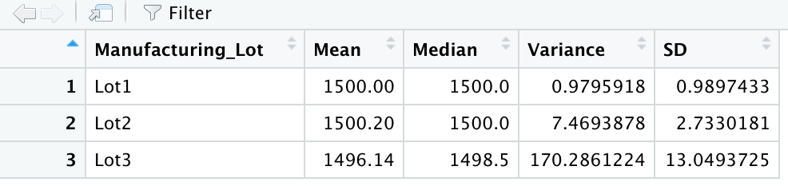
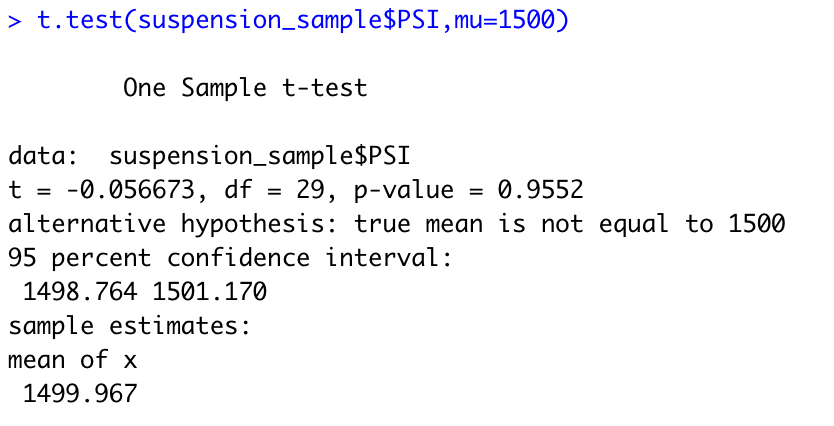
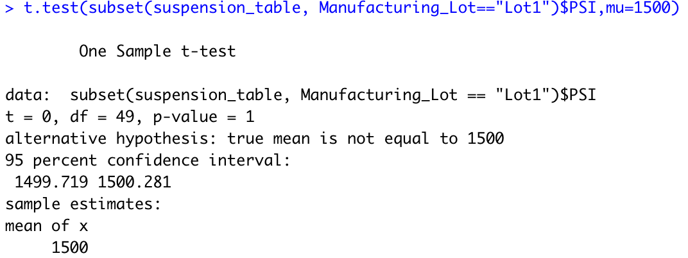
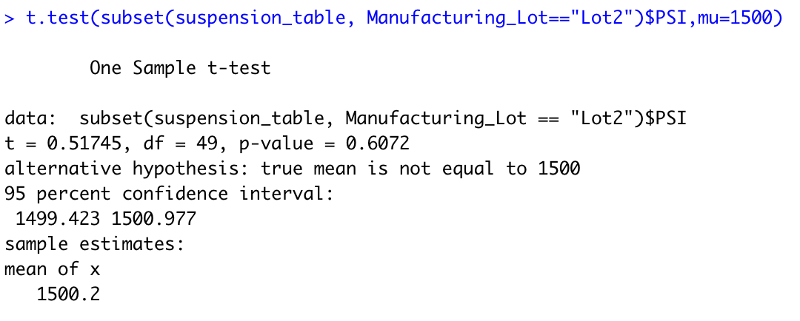
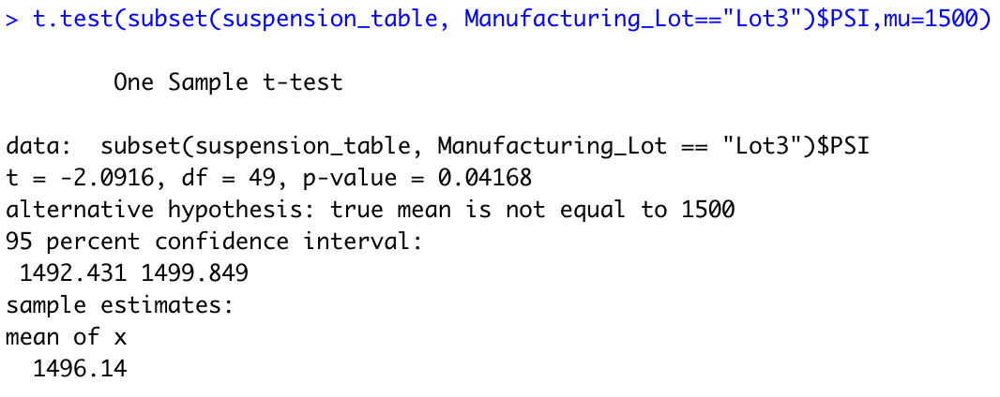

# MechaCar Statistical Analysis

## Overview
The newest AutosRUs’ prototype MechaCar is suffering production troubles which blocking the manufacturing team’s progress. Therefore, the data analytics team needs to review the production data for insights that may help the manufacturing team making the following:
  - Perform multiple linear regression analysis to identify which variables in the dataset predict the mpg of MechaCar prototypes
  - Collect summary statistics on the pounds per square inch (PSI) of the suspension coils from the manufacturing lots
  - Run t-tests to determine if the manufacturing lots are statistically different from the mean population

## Resources
  - Programming language: R
  - IDE: RStudio 2021.09.2
  - Library: tidyverse
  - Data sources: MechaCar_mpg.csv and Suspension_Coil.csv

## Results

## Linear Regression to Predict MPG
The MechaCar_mpg.csv file contains fuel efficiency (mpg) test results for 50 prototype MechaCars. To predict the mpg of MechaCar prototypes using more than one variable from the MechaCar_mpg.csv dataset, we defined a multiple linear regression model with the metrics vehicle length, vehicle weight, spoiler angle, drivetrain, and ground clearance as independent variables. Using R, we got the outcomes:

According to our results, vehicle length and ground clearance (as well as intercept) are statistically unlikely to provide random amounts of variance to the linear model, so vehicle length and ground clearance have a significant impact on fuel efficiency.

The p-value of our linear regression analysis is 5.35 x 10-11, which is much smaller than our assumed significance level of 0.05%. Therefore, we can state that there is sufficient evidence to reject our null hypothesis, which means that the slope of our linear model is not zero.

We can conclude that the performance of this model performs well with the current dataset due to the lack of more significant variables.

## Summary Statistics on Suspension Coils
The weight capacities of multiple suspension coils were tested to determine if the MechaCar manufacturing process is consistent across production lots. We created in R the following summary statistics using the MechaCar Suspension_Coil.csv dataset:

-	The mean, median, variance, and standard deviation of the suspension coil’s PSI

 

-	The mean, median, variance, and standard deviation of the suspension coil’s PSI by Manufacturing Lot

  

The variance for the entire dataset indicates the current manufacturing data meets the 100 pounds per square inch variance limitation. However, analyzing by manufacturing lot, the third lot showcases a higher variance of 170.3. Therefore, the current manufacturing data does not meet the design specification for all manufacturing lots in total and each lot individually.

## T-Tests on Suspension Coils
 
We performed a T-Test on Suspension Coils dataset to determine if all manufacturing lots and each lot individually are statistically different from the population mean of 1,500 pounds per square inch.

The outcomes using the t.test() function with a sample of 20% of total objects to determine if the PSI across all manufacturing lots is statistically different from the population mean of 1,500 pounds per square inch are following.

 

The p-value of our analysis is 0.96, therefore we can state that there is sufficient evidence to reject our null hypothesis, which means that there are no statistical differences between the sample and the population mean.

We got the following results using the t.test() function and its subset() argument to determine if the PSI for each manufacturing lot is statistically different from the population mean of 1,500 pounds per square inch.

  - Manufacturing Lot 1
 

  - Manufacturing Lot 2
 

  - Manufacturing Lot 3
 

According with our analysis outcomes, Manufacturing Lot #3 has statistical differences with the population mean with a p-value of 0.042 smaller than our assumed significance level of 0.05%. Therefore, there is sufficient evidence to reject the null hypothesis.

## Study Design: MechaCar vs Competition
